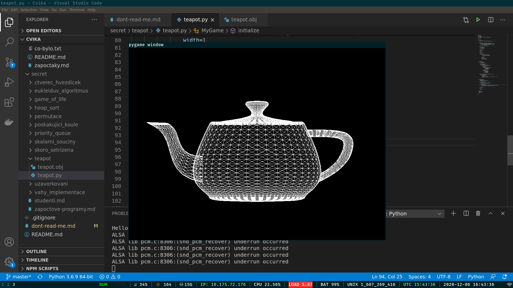

# Aladin a kouzelná lampa

> V souboru `teapot.obj` se nachází kouzelná lampa s džinem. Aby vám džin mohl splnit přání, musíte jeho lampu najít a zobrazit v pygame.

Vaším úkolem je načíst a zobrazit soubor `teapot.obj`

- Odkaz na model v repozitáři [zde](https://github.com/Jirka-Mayer/NPRG030-062/blob/master/prg/2020-12-07/teapot.obj)
- Lore [zde](https://en.wikipedia.org/wiki/Utah_teapot)

Soubor `.obj` obsahuje dva druhy řádků textu:

```
v -0.590089 2.440800 -1.134190
v -0.588230 1.621875 -1.751120
v -0.588230 1.621875 1.751120
v -0.585750 2.550000 -0.585750
...

f 2709 2708 2606
f 2606 2612 2709
f 2801 2800 2708
f 2708 2709 2801
...
```

Nejdříve máme řádky začínající znakem `v`. Tyto řádky značí body (vertex) ve 3D prostoru. Vy je můžete načíst jako pole vektorů (tedy `Vector3`). Tři čísla jsou postupně souřadnice X, Y a Z. Pořadí bodů v souboru je důležité (viz. níže).

Poté máme řádky začínající znakem `f`. Tyto řádky značí stěny (face), ale jedná se pouze o trojúhelníky. Tři čísla značí indexy vrcholů, které tvoří daný trojúhelník. Pozor! Vrcholy jsou indexované od `1`čky.

Vaším cílem je konvičku načíst a dvojrozměrně vykreslit. Vykreslení provedete tak, že prostě zahodíte jednu dimenzi a budete kreslit trojúhelníky dvojrozměrně. (což je efektivně pravoúhlá projekce)

Pokud máte v pygame instanci `v` typu `Vector3`, tak z něho můžete udělat `Vector2` tečkovým přístupem: `v.xy` nebo `v.xz` nebo `v.zy` apod.

Dejte si pozor na rozměry. Kreslení v pygame probíhá v pixelech (`0` až `~700`), kdežto konvička je uložená v prostoru od `-3.0` do `+3.0` ve všech osách, takže budete muset vrcholy správně přemístit a přeškálovat. Pokud to neuděláte, tak vaše konvička skončí jako 3 bílé pixely v levém horním rohu.

Pro kreslení můžete použít funkci `pygame.draw.polygon(...)`. Ostatní nechám na vás. Cílem je, aby se konvička vykreslila, z jakého pohledu nebo jakou barvou už je na vás.

Řešení mi pošlete jako `.zip` na mail. (ano, bude to chtít alespoň 2 soubory - skript a `teapot.obj`).

Tady je screenshot mého řešení:


